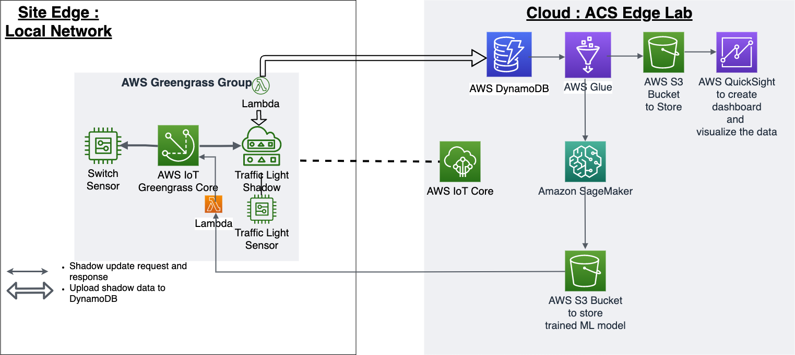
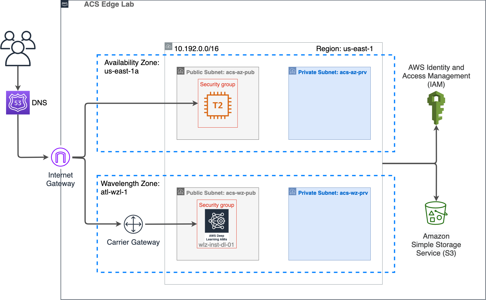
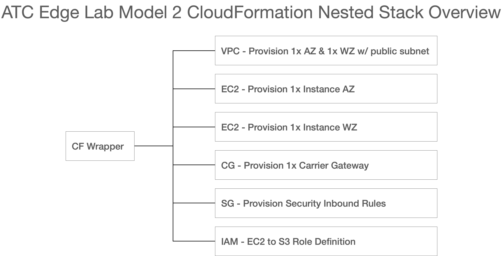

```
AUTHOR: Supriya Jadhav

Version: 1.0

Date: Feb 2022

© 2025 Supriya Sampat Jadhav. All rights reserved.
```
This Repository is a collection of all the artifacts, documents, sample scripts etc used in setting up demo edge computing lab in AWS cloud.

# Edge-IoT-AWS-Powered-Intelligent-Traffic-Light-Control

Built an edge-based IoT traffic light control solution integrated with AWS cloud analytics, enabling real-time vehicle detection, dynamic signal adjustments, and data-driven traffic optimization.

## 1. Edge Lab: Model 1

On-site Edge environment set up has two parts. First, software installation and configuration on compute at the edge. It lets you connect and process equipment data on-premises for low latency applications that must continue to work even if connection to the cloud is unavailable:

* Configuring AWS IoT Greengrass cores and groups
* Deployment process for running AWS Lambda functions at the edge
* Connecting AWS IoT devices to the AWS IoT Greengrass core
* Creating subscriptions to allow MQTT communication between locallambda functions, devices and AWS IoT

Second, use other AWS services in the cloud for data management and to performa data analytics and train statistical model which is then deployed at the edge to take smart decisions in real world:

* Database Services to collect the data
* ETL services to prepare the actionable data in cloud
* Analytics services to build dashboard and visualize the data
* Jupyter notebooks to build ML/DL models

### Architecture Solution

Below is the architecture of proposed IoT solution to build the Edge Lab Model 1 use case : Smart Traffic Light Management System. I have successfully built and deployed the Edge Lab Model 1 PoC with following assumptions:

Site Edge Location: Hana Highway, Route in Maui County, Hawaii

Cloud : ACS Edge Lab in Atlanta

Devices: Traffic Light Sensor, Switch Sensor



### Getting Started

This repository provides following quick-starts to set up the Edge Lab Model 1:

1. Find the complete set-up documentation guide as follows:

```
Edge Lab Model 1 implementation:

1. Raspberry Pi : Set up IoT devices to generate dummy traffic light data 
2. AWS IoT Greengrass: Configure IoT devices with AWS cloud using Greengrass group and core devices
3. Lambda function 01 : Collect data from AWS Greengrass group and send it to DynamoDB
4. DynamoDB: CarStats data (Key-Value) (Low latency, fully-managed)
5. Glue Crawler: (Streaming data) Define crawler to periodically refresh data from source and move to S3.
6. Glue job: ETL from DynamoDB (key-value format) to S3 bucket(csv format)
7. S3: (Actionable data)IoT data in csv formation 
    7a. QuickSight: Dashboard and analytics
    7b. Sagemaker : Train model using actionable data 
8. S3: Store trained model
9. Lambda 02: Use trained model saved in S3 bucket to deploy at the edge(Prediction on live data in real world)

```

2. [Find all the scripts used in Edge Lab Model 1 implementation here](01_Edge_Lab_Model_1/scripts)
3. [Sample actionable dataset used in analytics and modeling](01_Edge_Lab_Model_1/output)

### Clean-up the environment

> **Note:** Using Edge Lab Model 1 PoC in your AWS environment is free but provisioned resources will incur expenses.

To clean up the environment, go to the cloud environment :

1. Delete the Greengrass Certificate
2. Delete IoT Policy
3. Delete IoT Thing
4. Delete Greengrass Group
5. Delete Greengrass Lambda function
6. Delete Greengrass Lambda IAM Role and Policy
7. Delete table generated in DynamoDB
8. Delete AWS Glue crawler and AWS Glue job
9. Delete all S3 buckets that were created as a result of using various AWS services
10. Delete Notebook instance, Training jobs, Inference Model and Endpoints
11. Unsubscribe AWS QuickSight

### Technologies Used

| Resource | Details |
|----------|---------|
| Cloud Technology | AWS Cloud |
| Edge computing technology | AWS IoT Greengrass |
| Edge Compute | Intel instance using Deep Learning AMI (Amazon Linux)|
| IoT devices | Traffic Light and Switch |
| Database | AWS DynamoDB |
| ETL | AWS Glue |
| Storage | AWS S3 |
| ML Platform | AWS SageMaker |
| Analytics | AWS QuickSight / AWS IoT Analytics |
| Scripting Language | Python 3 and AWS CLI |


## 2. Edge Lab: Model 2

Provision resources in the cloud and perform object detection inference in a wavelength zone with real-time responsiveness to the devices used like mobile, web camera etc.

### Architecture Solution

Below is the proposed architecture solution to set-up Edge Lab Model 2 use case, which is successfully tested and implemented in the edge lab of our technology center in Atlanta:



### Getting Started

A high level overview fo how cloudformation nested stack works to spin up the resources to AWS cloud:



Get started with setting up the Edge Lab Model 2:

1. Find the complete set-up documentation guide here
```
# Model 2 Provisioning Guide

Use this Step-by-step guide to set up the Edge Lab Model 2 Demo.  It is
comprised of two stages:

1. Deploy CloudFormation Template: provision resources and their dependencies in
AWS cloud
2. Execute Python script to initiate Inference Analysis: Python script runs on a
G2 instance using Deep Learning framework (PyTorch) for object detection
in videos/images.

## 1. Setup Environment: Deploy CloudFormation Template

AWS CloudFormation templates are used to deploy required resources to run the
ATC Edge Demo Lab Model 2.

> AWS CloudFormation is infrastructure as code service that provides an easy way
> to provision collections of related AWS resources and their dependencies
> in the cloud.

For this demonstration, a CloudFormation template was developed to configure the
required resources and dependencies. A wrapper CF file was used launch and
configure them together as a complete stack.

> `root-atc-edge-lab-model-1.yaml` will provision the resources needed.

### Resources Provisioned

#### Availability Zone

|Key|Value|
|---:|:---|
|Availability Zone:|us-east-1a|
|Subnet:|public|
|EC2:|t2.micro|
|Description:|bastion|
|Security Group:|ingress rule|
||ec2 security group|
|Routing:|az public route table|
||subnet route table association|

#### Wavelength Zone

|Key|Value|
|---:|:---|
|Wavelength Zone:|us-east-1-wl1-atl-wlz1|
|Subnet:|public|
|EC2:|g4n.2xlarge|
|Description:|deep learning instance
|Security Group:|ingress rule|
||ec2 security group|
|Routing:|az public route table|
||subnet route table association|
|Gateway:|carrier gateway|

#### Supporting Resources
|Key|Value|
|---:|:---|
|VPC:|ACS Edge VC|
|Carrier Gateway:|cg1|
|Internet Gateway:|ig1|
|EC2:|g4n.2xlarge|
|Description:|deep learning instance
|Security Group:|ingress rule|
||ec2 security group|
|Routing:|az public route table|
||subnet route table association|
|Gateway:|carrier gateway|

### Configure Stack in AWS

```
2. [Required CloudFormation scripts here](02_Edge_Lab_Model_2/cf_nested_stacks)
3. [Python script to perform object detection here](02_Edge_Lab_Model_2/scripts/Predictor3.py)
4. [Sample image output can be found here](02_Edge_Lab_Model_2/output/car_output.jpg)

### Clean-up the environment

> **Note:** Using AWS CloudFormation Designer and Provisioning are free but provisioned resources will incur expenses.

To clean up the environment and all resources, delete the root stack.  This will delete all the associated resources provisioned by this stack.

### Technologies used:


| Resource | Details |
| - | - |
| Cloud Technology: | AWS Cloud |
| Infrastructure as a Code: | AWS CloudFormation |
| Deep Learning Framework: | PyTorch Deep Learning Framework |
| Scripting Language: | Python 3.7 and AWS CLI |

### Useful links:

1. [AWS Cloud](https://aws.amazon.com/)
2. [AWS IoT Greengrass](https://docs.aws.amazon.com/greengrass/index.html)
3. [Hana Highway](https://en.wikipedia.org/wiki/Hana_Highway)
4. [Use case: Deploy 5G enabled application using AWS Cloud Wavelength](https://aws.amazon.com/blogs/compute/deploying-your-first-5g-enabled-application-with-aws-wavelength/)
5. [CloudFormation](https://aws.amazon.com/cloudformation/getting-started/)
6. [CloudFormation Nested Stack](https://docs.aws.amazon.com/AWSCloudFormation/latest/UserGuide/using-cfn-nested-stacks.html)
7. [Deep Learning Framework used](https://github.com/facebookresearch/detectron2)
